# Service Dependency Graph

**Last updated:** 2026-04-29 (Phase 14 D-DOC — refreshed from NetBox, Block 4.C state)

Generated from NetBox CMDB via `scripts/cmdb_source.py`.
Authoritative source: `netbox.internal`. To regenerate this graph:

```bash
CMDB_SOURCE=netbox python3 scripts/cmdb_source.py | python3 scripts/generate-dependency-graph.py
```

```mermaid
graph TB
    anythingllm["AnythingLLM"]:::ai
    caddy["Caddy Reverse Proxy"]:::infrastructure
    cadvisor["cAdvisor"]:::observability
    catt-controller["Cast-All-The-Things"]:::home-automation
    control-plane["Operator Control Plane"]:::control-center
    docker-socket-proxy-control["Docker Socket Proxy"]:::platform
    grafana["Grafana"]:::observability
    headscale["Headscale VPN Server"]:::infrastructure
    homarr["Homarr"]:::platform
    homeassistant-physical["Home Assistant (physical) — 192.168.10.141 (canonical)"]:::automation
    homepage["Homepage Control Center"]:::control-center
    litellm-gateway["LiteLLM Gateway"]:::ai
    mcp-docker-remote["MCP Docker Remote"]:::mcp
    mcp-docs-remote["MCP Docs Remote"]:::mcp
    mcp-filesystem-remote["MCP Filesystem Remote"]:::mcp
    mcpo-proxy["MCPO Proxy"]:::ai
    netbox["NetBox CMDB"]:::cmdb
    netbox-housekeeping["NetBox Housekeeping"]:::cmdb
    netbox-postgres["NetBox PostgreSQL"]:::data
    netbox-redis["NetBox Valkey DB"]:::data
    netbox-redis-cache["NetBox Valkey Cache"]:::data
    netbox-worker["NetBox Worker"]:::cmdb
    nextcloud["Nextcloud"]:::platform
    nextcloud-db["Nextcloud PostgreSQL"]:::data
    node-exporter["Node Exporter"]:::observability
    obot["Obot"]:::ai
    obot-mcp-server["Obot MCP Server"]:::ai
    obot-mcp-shim["Obot MCP Shim"]:::ai
    obot-shim-fitness["Obot Shim — Health & Fitness"]:::mcp-shim
    obot-shim-fitness-nanobot["Obot Nanobot — Health & Fitness"]:::mcp-shim
    obot-shim-generic-a["Obot Shim — Tool A"]:::mcp-shim
    obot-shim-generic-b["Obot Shim — Tool B"]:::mcp-shim
    obot-shim-generic-c["Obot Shim — Tool C"]:::mcp-shim
    obot-shim-github["Obot Shim — GitHub"]:::mcp-shim
    obot-shim-github-nanobot["Obot Nanobot — GitHub"]:::mcp-shim
    obot-shim-postgres["Obot Shim — PostgreSQL"]:::mcp-shim
    obot-shim-postgres-nanobot["Obot Nanobot — PostgreSQL"]:::mcp-shim
    obot-shim-semgrep["Obot Shim — Semgrep"]:::mcp-shim
    obot-shim-semgrep-nanobot["Obot Nanobot — Semgrep"]:::mcp-shim
    obot-shim-strava["Obot Shim — Strava"]:::mcp-shim
    obot-shim-strava-nanobot["Obot Nanobot — Strava"]:::mcp-shim
    obot-shim-weather["Obot Shim — Weather"]:::mcp-shim
    obot-shim-weather-nanobot["Obot Nanobot — Weather"]:::mcp-shim
    ollama["Ollama"]:::ai
    open-webui["Open WebUI"]:::ai
    openhands["OpenHands"]:::ai
    opnsense["OPNsense Firewall"]:::network
    plane["Plane CE"]:::platform
    plane-api["Plane API"]:::platform
    plane-beat["Plane Beat Scheduler"]:::platform
    plane-db["Plane PostgreSQL"]:::platform
    plane-minio["MinIO Object Storage"]:::platform
    plane-redis["Plane Redis"]:::platform
    plane-worker["Plane Worker"]:::platform
    plex["Plex Media Server"]:::media
    plex-mcp["Plex MCP Bridge"]:::integration
    prowlarr["Prowlarr"]:::media
    radarr["Radarr"]:::media
    seal-vault["Vault Auto-Unseal"]:::platform
    sonarr["Sonarr"]:::media
    sportarr["Sportarr"]:::media
    topology-api["Topology API"]:::observability
    uptime-kuma["Uptime Kuma"]:::visibility
    vault["HashiCorp Vault"]:::platform
    vaultwarden["Vaultwarden"]:::platform
    victoriametrics["VictoriaMetrics"]:::observability
    vmagent["VMAgent"]:::observability
    zabbix-agent["Zabbix Agent"]:::monitoring
    zabbix-postgres["Zabbix PostgreSQL"]:::data
    zabbix-server["Zabbix Server"]:::monitoring
    zabbix-web["Zabbix Web UI"]:::monitoring

    ollama --> anythingllm
    vmagent --> cadvisor
    caddy --> control-plane
    prowlarr --> control-plane
    radarr --> control-plane
    sonarr --> control-plane
    vault --> control-plane
    control-plane --> docker-socket-proxy-control
    victoriametrics --> grafana
    caddy --> homepage
    grafana --> homepage
    plane-api --> homepage
    prowlarr --> homepage
    radarr --> homepage
    sonarr --> homepage
    uptime-kuma --> homepage
    vault --> homepage
    netbox-postgres --> netbox
    netbox-redis --> netbox
    netbox-redis-cache --> netbox
    vault --> netbox
    netbox --> netbox-housekeeping
    vault --> netbox-postgres
    vault --> netbox-redis
    vault --> netbox-redis-cache
    netbox --> netbox-worker
    nextcloud-db --> nextcloud
    litellm-gateway --> obot
    obot --> obot-mcp-server
    obot-mcp-server --> obot-mcp-shim
    obot --> obot-shim-fitness
    obot-shim-fitness --> obot-shim-fitness-nanobot
    obot --> obot-shim-generic-a
    obot --> obot-shim-generic-b
    obot --> obot-shim-generic-c
    obot --> obot-shim-github
    obot-shim-github --> obot-shim-github-nanobot
    obot --> obot-shim-postgres
    obot-shim-postgres --> obot-shim-postgres-nanobot
    obot --> obot-shim-semgrep
    obot-shim-semgrep --> obot-shim-semgrep-nanobot
    obot --> obot-shim-strava
    obot-shim-strava --> obot-shim-strava-nanobot
    obot --> obot-shim-weather
    obot-shim-weather --> obot-shim-weather-nanobot
    litellm-gateway --> open-webui
    ollama --> open-webui
    litellm-gateway --> openhands
    plane-api --> plane
    plane-db --> plane
    plane-minio --> plane
    plane-redis --> plane
    plane-db --> plane-api
    plane-minio --> plane-api
    plane-redis --> plane-api
    plane-db --> plane-beat
    plane-redis --> plane-beat
    plane-db --> plane-worker
    plane-redis --> plane-worker
    vault --> plex-mcp
    prowlarr --> radarr
    prowlarr --> sonarr
    grafana --> topology-api
    node-exporter --> vmagent
    victoriametrics --> vmagent
    zabbix-server --> zabbix-agent
    zabbix-postgres --> zabbix-server
    zabbix-postgres --> zabbix-web
    zabbix-server --> zabbix-web

    classDef ai fill:#e1f5ff,stroke:#0288d1
    classDef platform fill:#f3e5f5,stroke:#7b1fa2
    classDef infrastructure fill:#fff3e0,stroke:#f57c00
    classDef observability fill:#e8f5e9,stroke:#388e3c
    classDef media fill:#fce4ec,stroke:#c62828
    classDef monitoring fill:#fff9c4,stroke:#f9a825
    classDef mcp fill:#e0f2f1,stroke:#00695c
    classDef mcp-shim fill:#f1f8e9,stroke:#558b2f
    classDef data fill:#e8eaf6,stroke:#283593
    classDef automation fill:#fbe9e7,stroke:#bf360c
    classDef home-automation fill:#fbe9e7,stroke:#bf360c
    classDef network fill:#efebe9,stroke:#4e342e
    classDef cmdb fill:#e3f2fd,stroke:#0277bd
    classDef control-center fill:#f9fbe7,stroke:#827717
    classDef integration fill:#fce4ec,stroke:#880e4f
    classDef visibility fill:#f3e5f5,stroke:#6a1b9a
```



**Foundation layer (everything depends on these):**
- `vault` → auto-unsealed by `seal-vault` (Transit)
- `caddy` → TLS terminator for all `*.internal` domains
- Per-service Vault Agent sidecars (run once at startup, render `credentials.env`)

**Key fan-in points:**
- `obot`: 17+ shims depend on it
- `vault`: 9+ services have direct dependencies
- `plane-db`: 4 Plane services depend on it
- `prowlarr`: fans out to sonarr, radarr, control-plane, homepage

**Categories:** 15 distinct categories across 74 active services (1 deprecated: `iap-dashboard`).
