# Service Dependency Graph

Generated from the platform CMDB. Source of truth as of Block 4.C C5
is NetBox (`http://netbox:8080`); read via `scripts/cmdb_source.py`
which dispatches on `$CMDB_SOURCE=yaml|netbox` and produces the same
canonical service shape from either backend. Originally introduced
in H1 §10 from `config/service-registry.yaml` (now the dual-source
fallback during C5 transition).

```mermaid
graph TB
    litellm-gateway[litellm-gateway]:::ai
    open-webui[open-webui]:::ai
    ollama[ollama]:::ai
    obot[obot]:::ai
    openhands[openhands]:::ai
    mcpo-proxy[mcpo-proxy]:::ai
    iap-dashboard[iap-dashboard]:::platform
    vault[vault]:::platform
    plane[plane]:::platform
    plane-api[plane-api]:::platform
    plane-db[plane-db]:::platform
    plane-minio[plane-minio]:::platform
    homarr[homarr]:::platform
    grafana[grafana]:::observability
    victoriametrics[victoriametrics]:::observability
    vmagent[vmagent]:::observability
    uptime-kuma[uptime-kuma]:::observability
    node-exporter[node-exporter]:::observability
    sonarr[sonarr]:::media
    radarr[radarr]:::media
    prowlarr[prowlarr]:::media
    sportarr[sportarr]:::media
    plex[plex]:::media
    homeassistant-container[homeassistant-container]:::automation
    homeassistant-physical[homeassistant-physical]:::automation
    anythingllm[anythingllm]:::ai
    plane-redis[plane-redis]:::platform
    plane-worker[plane-worker]:::platform
    plane-beat[plane-beat]:::platform
    obot-mcp-server[obot-mcp-server]:::ai
    obot-mcp-shim[obot-mcp-shim]:::ai
    opnsense[opnsense]:::network
    zabbix-server[zabbix-server]:::monitoring
    zabbix-web[zabbix-web]:::monitoring
    zabbix-agent[zabbix-agent]:::monitoring
    zabbix-postgres[zabbix-postgres]:::data
    mcp-filesystem-remote[mcp-filesystem-remote]:::mcp
    mcp-docker-remote[mcp-docker-remote]:::mcp
    mcp-docs-remote[mcp-docs-remote]:::mcp
    obot-shim-postgres[obot-shim-postgres]:::mcp-shim
    obot-shim-postgres-nanobot[obot-shim-postgres-nanobot]:::mcp-shim
    obot-shim-github[obot-shim-github]:::mcp-shim
    obot-shim-github-nanobot[obot-shim-github-nanobot]:::mcp-shim
    obot-shim-weather[obot-shim-weather]:::mcp-shim
    obot-shim-weather-nanobot[obot-shim-weather-nanobot]:::mcp-shim
    obot-shim-fitness[obot-shim-fitness]:::mcp-shim
    obot-shim-fitness-nanobot[obot-shim-fitness-nanobot]:::mcp-shim
    obot-shim-semgrep[obot-shim-semgrep]:::mcp-shim
    obot-shim-semgrep-nanobot[obot-shim-semgrep-nanobot]:::mcp-shim
    obot-shim-strava[obot-shim-strava]:::mcp-shim
    obot-shim-strava-nanobot[obot-shim-strava-nanobot]:::mcp-shim
    obot-shim-homeassistant[obot-shim-homeassistant]:::mcp-shim
    obot-shim-homeassistant-nanobot[obot-shim-homeassistant-nanobot]:::mcp-shim
    obot-shim-generic-a[obot-shim-generic-a]:::mcp-shim
    obot-shim-generic-b[obot-shim-generic-b]:::mcp-shim
    obot-shim-generic-c[obot-shim-generic-c]:::mcp-shim
    caddy[caddy]:::infrastructure
    headscale[headscale]:::infrastructure
    vaultwarden[vaultwarden]:::platform
    nextcloud[nextcloud]:::platform
    nextcloud-db[nextcloud-db]:::data

    open-webui --> litellm-gateway
    open-webui --> ollama
    obot --> litellm-gateway
    openhands --> litellm-gateway
    plane --> plane-api
    plane --> plane-db
    plane --> plane-redis
    plane --> plane-minio
    plane-api --> plane-db
    plane-api --> plane-redis
    plane-api --> plane-minio
    grafana --> victoriametrics
    vmagent --> victoriametrics
    vmagent --> node-exporter
    sonarr --> prowlarr
    radarr --> prowlarr
    anythingllm --> ollama
    plane-worker --> plane-db
    plane-worker --> plane-redis
    plane-beat --> plane-db
    plane-beat --> plane-redis
    obot-mcp-server --> obot
    obot-mcp-shim --> obot-mcp-server
    zabbix-server --> zabbix-postgres
    zabbix-web --> zabbix-server
    zabbix-web --> zabbix-postgres
    zabbix-agent --> zabbix-server
    obot-shim-postgres --> obot
    obot-shim-postgres-nanobot --> obot-shim-postgres
    obot-shim-github --> obot
    obot-shim-github-nanobot --> obot-shim-github
    obot-shim-weather --> obot
    obot-shim-weather-nanobot --> obot-shim-weather
    obot-shim-fitness --> obot
    obot-shim-fitness-nanobot --> obot-shim-fitness
    obot-shim-semgrep --> obot
    obot-shim-semgrep-nanobot --> obot-shim-semgrep
    obot-shim-strava --> obot
    obot-shim-strava-nanobot --> obot-shim-strava
    obot-shim-homeassistant --> obot
    obot-shim-homeassistant --> homeassistant-container
    obot-shim-homeassistant-nanobot --> obot-shim-homeassistant
    obot-shim-generic-a --> obot
    obot-shim-generic-b --> obot
    obot-shim-generic-c --> obot
    nextcloud --> nextcloud-db

    classDef ai fill:#e1f5ff,stroke:#0288d1
    classDef platform fill:#f3e5f5,stroke:#7b1fa2
    classDef infrastructure fill:#fff3e0,stroke:#f57c00
    classDef observability fill:#e8f5e9,stroke:#388e3c
    classDef misc fill:#f5f5f5,stroke:#616161
```

**Foundation services**: vault-server (auto-unsealed via seal-vault), caddy (TLS reverse proxy), all per-service Vault Agent sidecars.

**Categories**: 11 distinct categories across 61 services.
